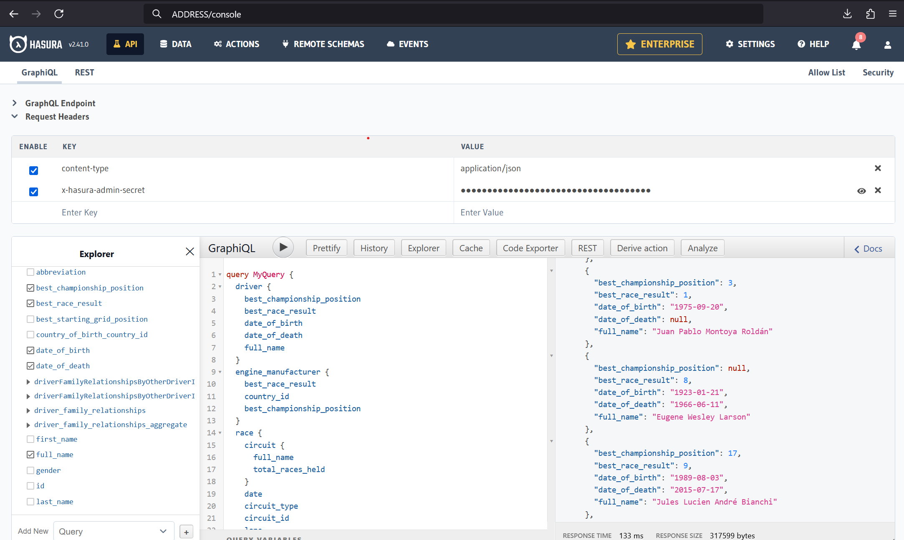

# GraphQL F1 historical data API


GraphQL API providing historical F1 data, built with Hasura.

## Tech stack:
* Hasura
* Kubernetes
* Helm
* Postgres


## Installation instruction

Just use helm to add repo and install this chart:
```
helm repo add p2vvel_f1 https://p2vvel.github.io/graphql_f1/
helm install --wait --timeout 600s f1 p2vvel_f1/graphql_f1
```

Pay attention to the `--wait` used above. It's necesssary to make sure that metadata migration job will run when database with F1 data is initialized (Postgres image does not accept connections when running .sql scripts e.g. importing dump). That behaviour might seem a little tricky, so documentation source >[here](https://helm.sh/docs/intro/using_helm/#helpful-options-for-installupgraderollback)<.

Custom `--timeout` is necessary, because importing dump containing F1 data was taking approximately 5-10 minutes during testing.

## Usage

### Console

Console is a Hasura built-in admin page that lets you execute queries and manage databases and schemas. You can access this page using `ADDRESS` and `ADMIN SECRET`.



### Direct API Queries

You can also execute direct queries to the API. Service is pre-configured to allow you for read operations without any authentication. Here is simple curl example:

```
curl --location 'ADDRESS/v1/graphql' \
--header 'Content-Type: application/json' \
--data '{"query":"query MyQuery {driver {full_name}}"}'
```


### Getting `ADDRESS` and `ADMIN SECRET` values

You can access `ADDRESS` and `ADMIN SECRET` values using help notes that will be shown to you after successfull installation.


### Data source
This project uses database dumps downloaded from [github.com/f1db](https://github.com/f1db/f1db).